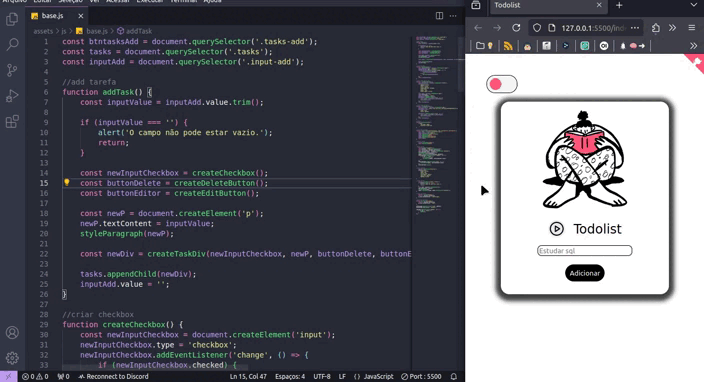

## Todolofi 🎧

***☆  Todolist com player de músicas lofi.***

⬇️ Disponível na [web](https://todolofi.netlify.app/) e no [Linux](https://github.com/aglairvta/Projetos/releases/tag/Todolofi).
***
### Demo:

<p align="center">
  
</p>

<p align="center">
 Veja no ar: <a href="https://todolofi.netlify.app/" target="_blank">Demo</a>
</p>

<p align="center">
  
   
  
</p>

***
Créditos: 🌟 

☆ [Github Corners](https://tholman.com/github-corners/)

☆ [Ilustração](https://blush.design/pt)

☆ [Fontes](https://fonts.google.com)

☆ [Ícones](https://iconsvg.xyz/)
***
### Uso:
☛ Acesse na web: [website](https://todolofi.netlify.app/)

⬇️ Baixe no Linux: [releases](https://github.com/aglairvta/Projetos/releases/tag/Todolofi) 

- Baixe a versão .appimage
- Dê permissão de execução: ```sudo chmod +x 
Todolofi-2.0.0.AppImage ```  
***
### Compilação:
✹ Clone o repositório ⇢ ```git clone https://github.com/aglairvta/Projetos.git```

✹ Acesse o diretório Todolofi ⇢ ```cd Projetos/6.\ Todolofi/```

✹ Instale as dependências ⇢ ```npm install```

**Execute**

☛ Web ⇢ ```npm start```

⬇️ Linux ⇢ ```npm run dist```
***
